# VM-Creation-For-UNO-Students
This is a tutorial on how to create Virtual Machines Using VMWare Pro/Fusion/Player. We will not be providing any Operating Systems. If you would like a Windows Operating System, you can buy a key from OnTheHub or from Microsoft. If you want a Linux distrubution, you can download the ISO from their respective websites. This will NOT show how to make Virtual Machines of MacOS.
 
Note: Make sure to save any work before you start this installation. Once you install your VMWare product, it will require you to reboot your machine.
 

## Please access UNO's OnTheHub page at https://unomaha.onthehub.com/ and click the sign in button on the top right of the page.
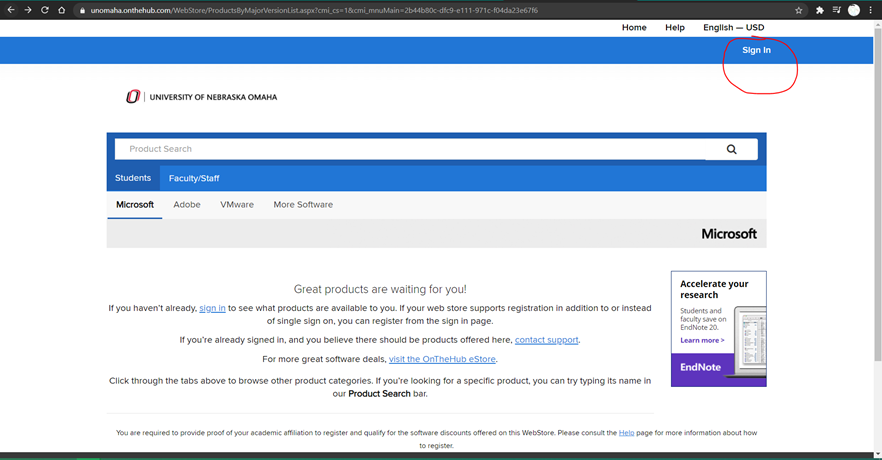
 
## This will then ask you to sign in with your NetID and password.
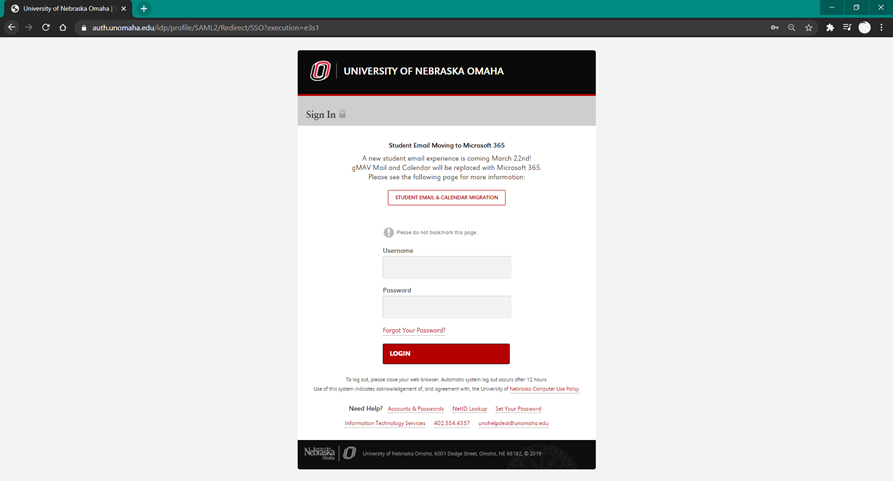
 

## After you sign in, you will be greeted with a similar page. On this page, you should be able to see where it says `Students` and `Faculty/Staff`. Select whichever option is best for you and then select `VMWare` from the gray bar.
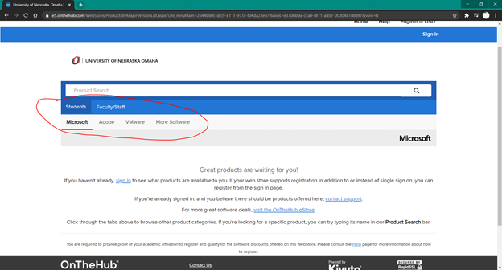
 

## You should now have a list of software to select from. The `VMware Workstation` line of products are for Windows and Linux, while `VMWare Fusion` is for Mac. Both products have a `Player` and a `Pro` variant. `Player` is intended to give you the most basic version of VMWare Functions, such as creating and editing VMs. `Pro` gives you additional features, such as connecting to a remote server.
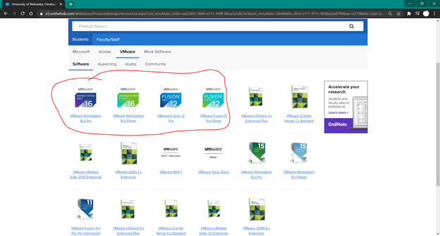
 

## Add your selected product to your cart and select checkout. You should be able to checkout without adding any kind of payment (Unless you are buying extra stuff that isn't free).
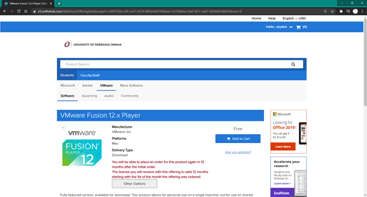
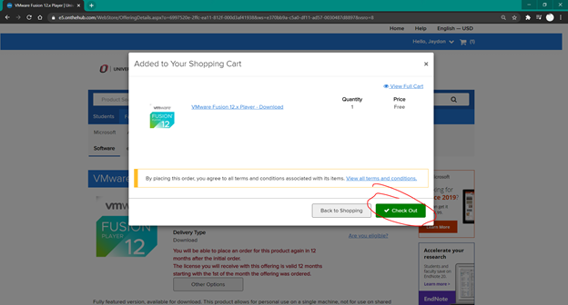
 

## Once you check out, you should reach the following page. DO NOT CLOSE THIS PAGE AS YOU WILL NEED IT FOR THE SERIAL NUMBER AND PRODUCT DOWNLOAD. Please download the product and run the installer.
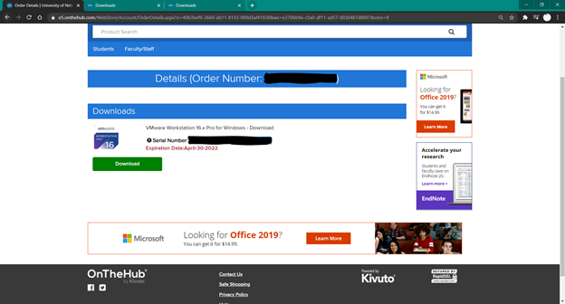
 

## Please continue through the installation until you get to the screen that says `Complete the VMWare Workstation Pro Setup Wizard`, then you will click the `License`. Copy and paste the Serial Number from your order page and reboot your PC when it asks. Once your PC has rebooted, please open your VMWare product.
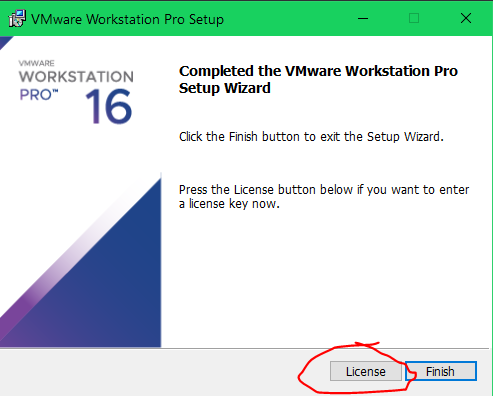
 

## For this example, an "Ubuntu" VM will be created. To start the creation process, please click `Create a New Virtual Machine`. We will show you the creation of a basic Virtual Machine with minimal specifications. You may need to change these settings based on your needed enviroment. 
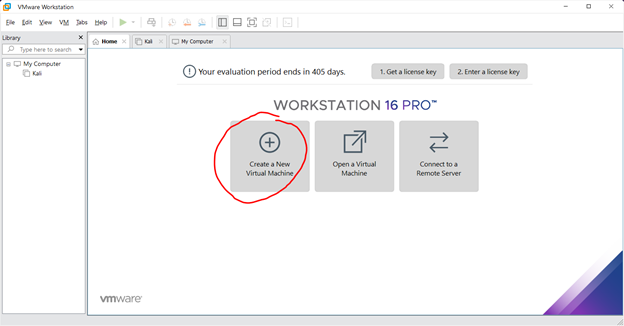
 

## There will be two (2) options: Typical and Custom.
## Typical will allow you to change the following options:
* Guest Operation System Installation
* Name of the Virtual Machine
* Disk Capacity
* Memory
* Processors
* Sound Card
* Network Adapter
* USB Controller
* Printer
* Display
 

## In addition to the previous options, Custom allows you to change these options as well:
* VM Hardware Compatibility
* Firmware Type
* Number of processors and cores per processor
* Network Connection Type
* I/O Controller
* Disk Type
 

## We will be using the Typical setup. This will be created with Ubuntu and the following specifications:
* 30 GB Hard Drive
* 4 GB RAM
* 1 CPU with 2 Cores
 

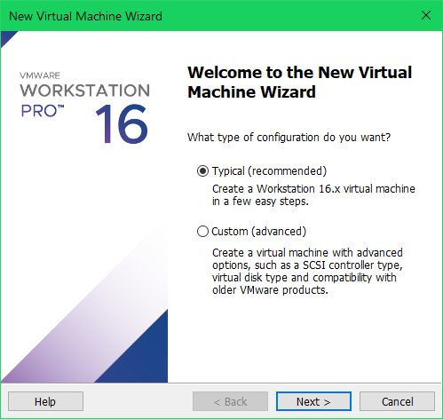

 

## When asked for an Operating System, use the `Browse...` option to locate the Ubuntu ISO. If you did not move the file to a new spot, it may still be in Downloads. Once the Operating System is selected, please click `Next`.
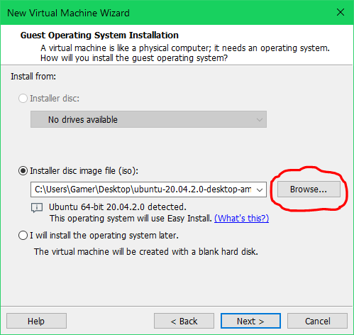
 

## Enter in some basic information to install on Ubuntu and click `Next`. Ubuntu has an Installation Assitance feature with VMs, so this will potentially create a new user for you and set the password.
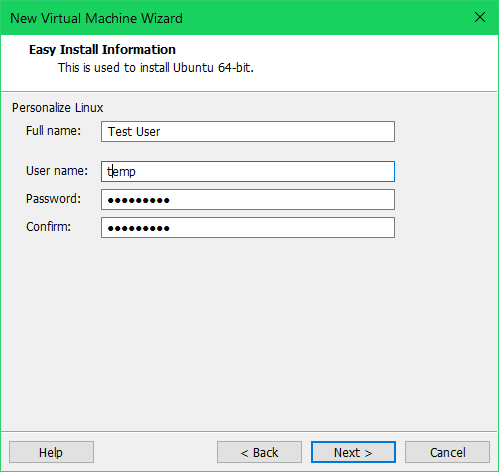
 

## Select a name for your Virtual Machine and set the location you wish to save your VM files. You can leave the location as default if you do not have a specific location you would like to put the VM. Click `Next`.
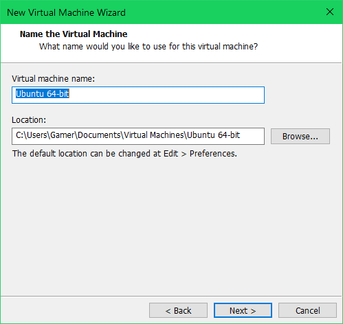
 

## When selecting disk space, VMWare will automatically recommend a disk size based on your selected Operating System. You may choose to increase or decrease this based on what you plan to use the VM for. For Ubuntu, it is recommended you use 20GB, but 30GB is used in this example. You can also choose to store the virtual disks as a single file or into multiple files. Leave this option as default if you do not know which to choose. Click `Next`.
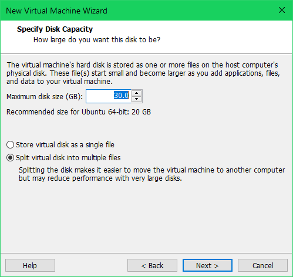
 

## Next, you will see a `Ready to Create Virtual Machine` window. We are going to change some of the hardware before we finalize the VM. Please select the **Customize Hardware...** option. However if the default settings appear to be up to your standards, you can select `Finish`.
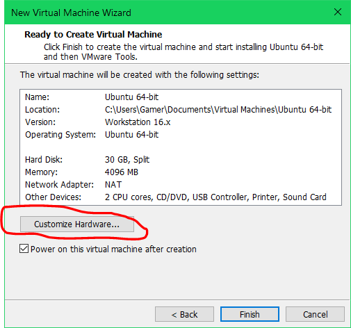
 

## For Memory (RAM), 4GB is needed MINIMUM. This is the required amount needed to start modern operating systems. This can be set to whatever is needed for the enviroment.
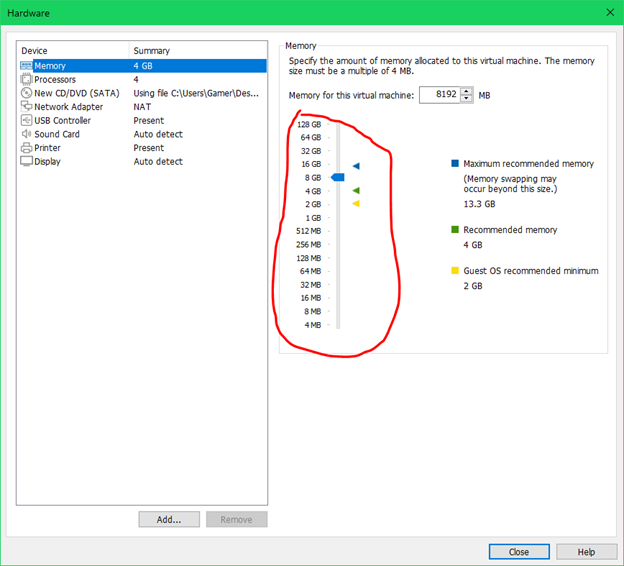
 

## For Processors, the default is 2 processors with 1 core. The example will use 1 processor with 2 cores. After chaning these options, you can click `Close` to return to the precious screen and select `Finish`.
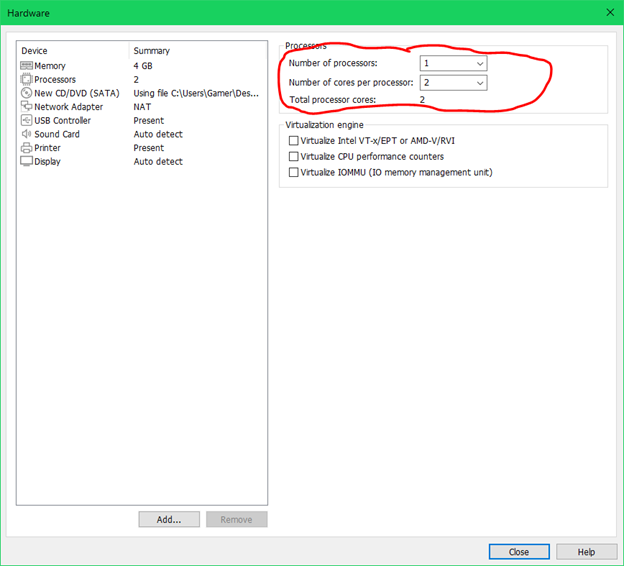
 

## The VM should now power on and continue with the setup as if the install was happening on a normal computer. Additional input may be required to finish setup.
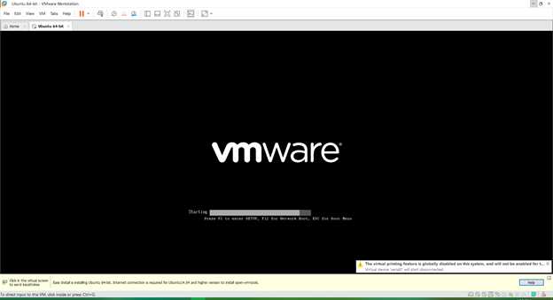
 

## If you have any issues with your VMWare products, creating a VM, or issues with the VM, please contact the professor first to verify any issues. If problem persists, please contant the Systems Office.
